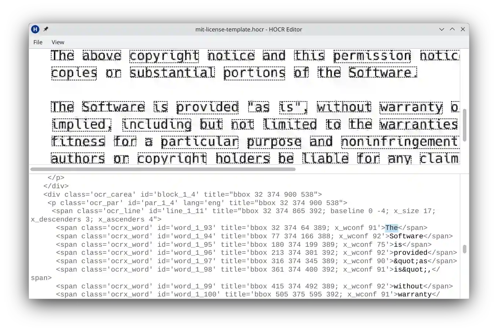

# hocr-editor-qt

graphical HOCR editor to produce minimal diffs for proofreading of tesseract OCR output

## usage

```
python hocr-editor.py test/data/mit-license-template/mit-license-template.hocr
```

## screenshot



## install

### Linux

#### NixOS Linux

```
nix-shell -p git
git clone https://github.com/milahu/hocr-editor-qt
cd hocr-editor-qt
nix-shell
```

#### Debian Linux

```
sudo apt install git python3

git clone https://github.com/milahu/hocr-editor-qt
cd hocr-editor-qt
pip install -r requirements.txt
```

### Windows

install `git` and `python3` with the [chocolatey package manager](https://chocolatey.org/install)

powershell &rarr; rightclick &rarr; run as admin

```
choco install git python3
```

now in a non-admin powershell

```
git clone https://github.com/milahu/hocr-editor-qt
cd hocr-editor-qt
pip install -r requirements.txt
```
